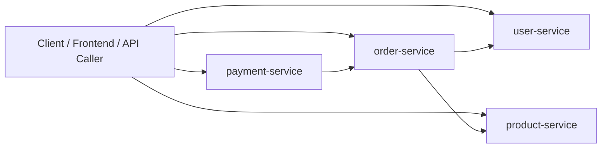
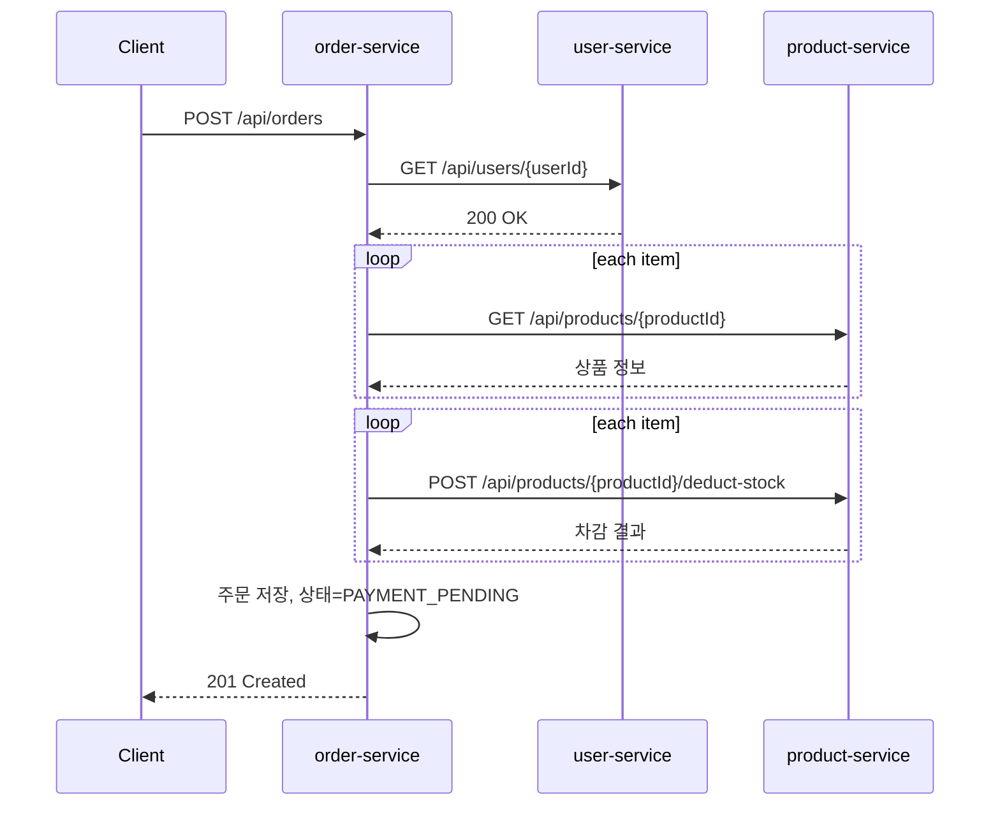
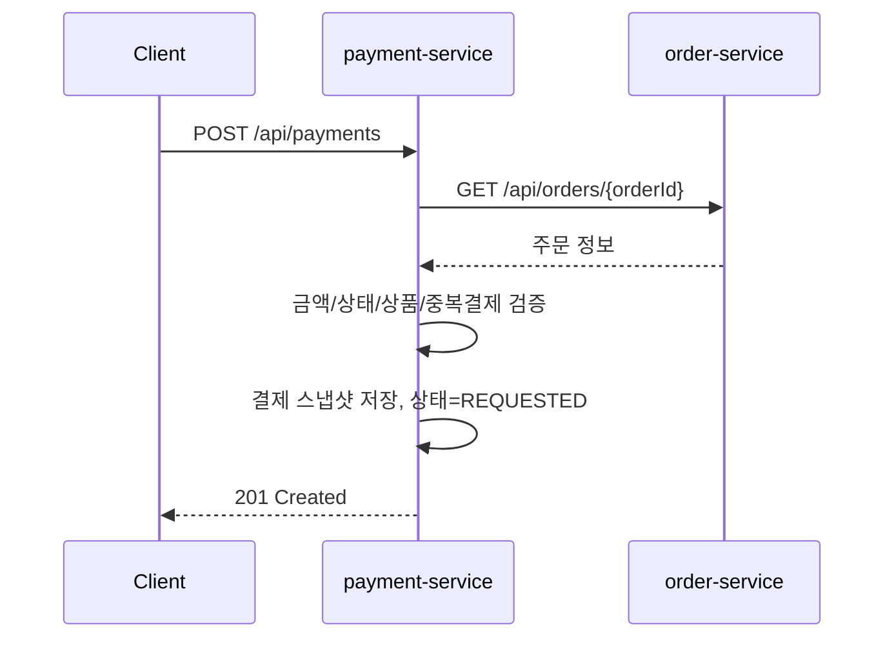
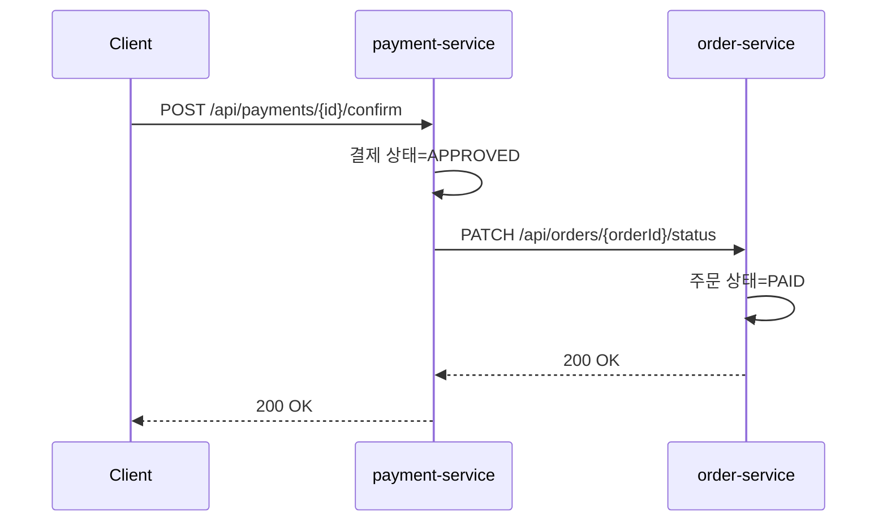
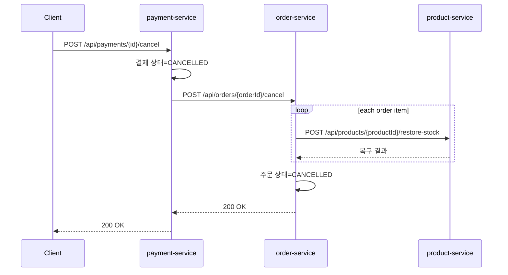

# 현재 구현 서비스 요청 플로우 정리

이 문서는 현재 저장소에 구현된 `user-service`, `product-service`, `order-service`, `payment-service`의 실제 요청 흐름을 정리한 문서다.

- 기준: 현재 코드 기준
- 관점 1: API 요청 관점
- 관점 2: 전체 서비스 흐름 설명 관점
- 제외: `probe`, `load-cpu`, `load-memory` 같은 운영/실습용 API

## 1. 참여 서비스와 역할

| 서비스 | 기본 포트 | DB 스키마 | 역할 |
| --- | --- | --- | --- |
| `user-service` | `8081` | `user_service_db` | 사용자 조회/생성/수정/삭제 |
| `product-service` | `8082` | `product_service_db` | 상품 조회/등록/수정/재고 차감/재고 복구 |
| `order-service` | `8083` | `order_service_db` | 주문 생성/조회/상태 변경/주문 취소 |
| `payment-service` | `8084` | `payment_service_db` | 결제 생성/조회/승인/취소 |

## 2. 서비스 간 호출 구조



핵심 의존 방향은 아래와 같다.

- `user-service`: 다른 도메인 서비스에 의존하지 않음
- `product-service`: 다른 도메인 서비스에 의존하지 않음
- `order-service`: `user-service`, `product-service`를 호출
- `payment-service`: `order-service`를 호출

## 3. API 요청 관점 정리

### 3.1 user-service

외부에서 직접 호출하는 사용자 API다.

- `GET /api/users`
- `GET /api/users/{id}`
- `POST /api/users`
- `PUT /api/users/{id}`
- `DELETE /api/users/{id}`

예시:

```http
GET /api/users/1
```

응답 예시:

```json
{
  "id": 1,
  "name": "alice",
  "email": "alice@example.com"
}
```

현재 `order-service`는 주문 생성 시 이 서비스의 `GET /api/users/{id}`를 내부적으로 호출해 사용자 존재 여부를 확인한다.

### 3.2 product-service

외부에서 직접 호출하거나 `order-service`가 내부적으로 호출하는 상품/재고 API다.

- `GET /api/products`
- `GET /api/products/{id}`
- `GET /api/products/sku/{sku}`
- `POST /api/products`
- `PUT /api/products/{id}`
- `PATCH /api/products/{id}/stock`
- `POST /api/products/{id}/deduct-stock`
- `POST /api/products/{id}/restore-stock`
- `DELETE /api/products/{id}`

주문 연동에서 실제로 중요한 API는 아래 3개다.

- 상품 조회: `GET /api/products/{id}`
- 재고 차감: `POST /api/products/{id}/deduct-stock`
- 재고 복구: `POST /api/products/{id}/restore-stock`

재고 차감 요청 예시:

```http
POST /api/products/1/deduct-stock
Content-Type: application/json
```

```json
{
  "quantity": 2
}
```

### 3.3 order-service

외부에서 주문을 만들거나 조회할 때 호출하는 API다.

- `GET /api/orders`
- `GET /api/orders/{id}`
- `GET /api/orders/order-number/{orderNumber}`
- `POST /api/orders`
- `PATCH /api/orders/{id}/status`
- `POST /api/orders/{id}/cancel`

주문 생성 요청 예시:

```http
POST /api/orders
Content-Type: application/json
```

```json
{
  "userId": 1,
  "items": [
    {
      "productId": 1,
      "quantity": 2
    },
    {
      "productId": 2,
      "quantity": 1
    }
  ]
}
```

주문 생성 시 내부 호출 순서:

1. `order-service` -> `GET user-service /api/users/{userId}`
2. `order-service` -> `GET product-service /api/products/{productId}` 반복
3. `order-service` -> `POST product-service /api/products/{productId}/deduct-stock` 반복
4. 주문 저장
5. 주문 상태를 `PAYMENT_PENDING`으로 반환

주문 상태 변경 요청 예시:

```http
PATCH /api/orders/10/status
Content-Type: application/json
```

```json
{
  "status": "PAID"
}
```

이 API는 주로 `payment-service`가 결제 승인 시 내부적으로 호출한다.

주문 취소 요청 예시:

```http
POST /api/orders/10/cancel
```

이 API는 주로 `payment-service`가 결제 취소 시 내부적으로 호출한다.

### 3.4 payment-service

외부에서 결제를 만들고 승인/취소할 때 호출하는 API다.

- `GET /api/payments`
- `GET /api/payments/{id}`
- `GET /api/payments/order/{orderId}`
- `POST /api/payments`
- `POST /api/payments/{id}/confirm`
- `POST /api/payments/{id}/cancel`

결제 생성 요청 예시:

```http
POST /api/payments
Content-Type: application/json
```

```json
{
  "orderId": 10,
  "amount": 127000,
  "method": "CARD"
}
```

결제 생성 시 내부 호출 순서:

1. `payment-service` -> `GET order-service /api/orders/{orderId}`
2. 주문 상태, 주문 금액, 주문 상품 존재 여부 확인
3. 중복 활성 결제 여부 확인
4. 주문/상품 스냅샷 저장
5. 결제 상태를 `REQUESTED`로 저장 후 반환

결제 승인 요청 예시:

```http
POST /api/payments/20/confirm
```

결제 승인 시 내부 호출 순서:

1. 결제 상태를 `APPROVED`로 저장
2. `payment-service` -> `PATCH order-service /api/orders/{orderId}/status`
3. 요청 본문: `{ "status": "PAID" }`

결제 취소 요청 예시:

```http
POST /api/payments/20/cancel
Content-Type: application/json
```

```json
{
  "reason": "customer requested cancellation"
}
```

결제 취소 시 내부 호출 순서:

1. 결제 상태를 `CANCELLED`로 저장
2. 취소 시각/사유 저장
3. `payment-service` -> `POST order-service /api/orders/{orderId}/cancel`
4. `order-service`는 주문 상품별로 `product-service` 재고 복구 호출

## 4. 전체 흐름 설명 관점 정리

### 4.1 사용자 조회/확인 흐름

현재 사용자 서비스는 별도 회원 인증 서비스가 아니라, 주문 생성 시 사용자 ID가 유효한지만 확인하는 역할에 가깝다.

- 외부 사용자는 `user-service`로 사용자 목록/상세를 조회할 수 있다.
- 주문 생성 시 `order-service`는 전달받은 `userId`가 실제 존재하는지 `user-service`에 확인한다.
- 사용자가 없으면 주문은 생성되지 않는다.

즉, 사용자 서비스는 현재 주문 생성의 선행 검증 서비스다.

### 4.2 상품 조회와 재고 흐름

상품 정보와 재고 수량은 `product-service`가 단독 소유한다.

- 상품의 이름, 가격, 설명, SKU, 재고는 모두 `product-service`가 관리한다.
- 주문 서비스는 상품 정보를 직접 DB에서 읽지 않고 REST 호출로 조회한다.
- 주문 생성이 성공하면 재고를 차감한다.
- 주문 저장 중 실패하거나, 나중에 결제가 취소되면 재고를 복구한다.

즉, 상품/재고의 소유권은 `product-service`에 있고, 다른 서비스는 API로만 접근한다.

### 4.3 주문 생성 흐름

현재 주문 생성은 동기식 REST 체인으로 처리된다.



핵심 포인트:

- 주문은 처음부터 `PAID`가 아니라 `PAYMENT_PENDING`으로 생성된다.
- 재고 차감 이후 주문 저장이 실패하면, 이미 차감한 재고를 다시 복구한다.
- 주문 서비스는 사용자/상품 DB를 직접 조인하지 않는다.

### 4.4 결제 생성 흐름

결제는 주문이 먼저 존재해야 생성할 수 있다.



핵심 포인트:

- 결제 서비스는 주문 존재 여부를 직접 검증한다.
- 주문 상태가 `CREATED` 또는 `PAYMENT_PENDING`일 때만 결제를 허용한다.
- 결제 시점의 주문번호, 사용자 ID, 상품 요약 문자열, 주문 금액을 결제 DB에 스냅샷으로 저장한다.
- 현재 구조에서 한 주문에는 활성 결제가 하나만 허용된다.

### 4.5 결제 승인 흐름

결제 승인은 결제 상태와 주문 상태를 함께 바꾸는 흐름이다.



핵심 포인트:

- 현재 구현은 동기식 호출이다.
- 결제 서비스가 먼저 결제 상태를 `APPROVED`로 저장한 뒤 주문 상태 변경을 호출한다.
- 주문 서비스 PATCH 호출이 실패하면 현재는 예외를 반환하며, 이후 재처리 큐나 이벤트 저장은 아직 없다.

### 4.6 결제 취소와 재고 복구 흐름

결제 취소는 주문 취소와 상품 재고 복구까지 연결된 흐름이다.



핵심 포인트:

- 결제 취소는 단순히 결제 상태만 바꾸는 것이 아니다.
- 주문 상태를 `CANCELLED`로 바꾸고, 주문 생성 때 차감했던 재고를 복구한다.
- 이 구조 덕분에 주문/결제/상품 간 데이터 의존관계가 실제 동작 흐름으로 연결된다.

## 5. 데이터 관점에서 본 전체 흐름

현재 구조는 서비스별 독립 DB를 유지하면서, 서비스 간 참조는 ID와 스냅샷으로 연결한다.

### 5.1 user-service

- 사용자 원본 데이터 소유
- 다른 서비스는 `userId`만 참조

### 5.2 product-service

- 상품 원본 데이터와 재고 원본 데이터 소유
- 주문 서비스는 상품명/가격을 주문 생성 시점 스냅샷처럼 주문 항목에 저장

### 5.3 order-service

- 주문 원본 데이터 소유
- `userId`와 `productId`는 논리 참조
- 주문 항목에 상품명/단가/수량/소계를 저장

### 5.4 payment-service

- 결제 원본 데이터 소유
- 주문번호, 사용자 ID, 주문 상태, 주문 금액, 상품 요약 문자열을 결제 시점 스냅샷으로 저장

즉 현재 구조는 아래 원칙으로 동작한다.

- 원본 데이터는 각 서비스 DB에 분리
- 서비스 간 조회는 REST 호출
- 이력 보존이 필요한 정보는 주문/결제 DB에 스냅샷 저장

## 6. 현재 구현에서의 진입점 정리

외부 클라이언트 기준으로 보면 실제 사용 순서는 보통 아래와 같다.

1. `GET /api/users` 또는 `GET /api/users/{id}`로 사용자 확인
2. `GET /api/products`로 상품 목록 확인
3. `POST /api/orders`로 주문 생성
4. `POST /api/payments`로 결제 생성
5. 성공이면 `POST /api/payments/{id}/confirm`
6. 취소면 `POST /api/payments/{id}/cancel`

즉, 현재 구현된 핵심 업무 플로우는 아래 한 줄로 요약할 수 있다.

`사용자 확인 -> 상품 조회 -> 주문 생성(재고 차감) -> 결제 생성 -> 결제 승인 또는 결제 취소(주문 취소 + 재고 복구)`

## 7. 현재 구조의 특성 및 주의사항

- 현재는 API Gateway 없이 서비스별 API를 직접 호출하는 구조다.
- 서비스 간 호출은 모두 동기식 REST다.
- 이벤트 브로커(Kafka/RabbitMQ) 기반 비동기 처리나 Saga 오케스트레이션은 아직 없다.
- 결제 승인 후 주문 상태 변경 실패, 재고 복구 호출 실패에 대한 재처리 저장소는 아직 없다.
- 프론트엔드는 현재 `user-service` 조회 화면만 연결돼 있고, 주문/결제 화면은 아직 연결되지 않았다.

## 8. 문서 용도

이 문서는 아래 상황에서 기준 문서로 사용할 수 있다.

- 백엔드 API 동작 흐름 파악
- 프론트 주문/결제 화면 연결 설계
- Ingress 라우팅 설계 전 요청 경로 정리
- 추후 이벤트 기반 구조로 확장할 때 현재 동기식 흐름 비교 기준
