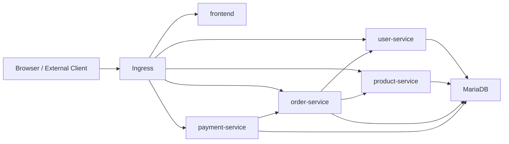

# Lab 1 Architecture

## 서비스 구조

실습 1의 애플리케이션 구조는 아래와 같은 MSA 형태다.

## 서비스 간 의존 관계

현재 구현 기준 서비스 간 호출 구조는 아래와 같다.

- `user-service`
  - 다른 도메인 서비스에 의존하지 않음
- `product-service`
  - 다른 도메인 서비스에 의존하지 않음
- `order-service`
  - `user-service`, `product-service` 를 호출
- `payment-service`
  - `order-service` 를 호출

이 구조는 `/Users/yangyewon/workspace/shopping-mall-k8s-lab/E-commerce/05.myapp-container/CURRENT_SERVICE_REQUEST_FLOW.md`
와 실제 코드 기준으로 정리된 내용이다.

## Ingress 구조

같은 host 아래 path 기반 라우팅으로 외부 접근을 구성했다.

- `/api/users` -> `user-service`
- `/api/products` -> `product-service`
- `/api/orders` -> `order-service`
- `/api/payments` -> `payment-service`
- 프론트 경로 -> `frontend`
- Swagger / Actuator 접근도 별도 ingress 규칙으로 구성

## 운영 요소

실습 1에서 적용한 운영 요소는 아래와 같다.

- 각 서비스별 `readinessProbe`
- 각 서비스별 `livenessProbe`
- 일부 서비스의 `startupProbe`
- ConfigMap / Secret 을 통한 설정 분리
- ScaledObject / HPA 를 통한 scale-out 실험
- PriorityClass 적용

## 대량 요청 처리 관점의 의미

실습 1은 단순 배포가 아니라 "대량 요청 상황에서도 서비스를 운영 가능한 형태로 만들기"가 목표였다.
그래서 아래 항목들이 중요했다.

- Pod 를 서비스 단위로 분리해 독립적으로 운영
- Probe 를 통해 비정상 Pod 가 트래픽을 받지 않도록 구성
- Ingress 를 통해 외부 접근을 표준화
- HPA / KEDA 로 요청 증가 시 Pod 증설 가능성을 검증
- 자원 부족 / 이미지 pull 문제 발생 시 안정 버전으로 되돌리는 운영 판단 수행
