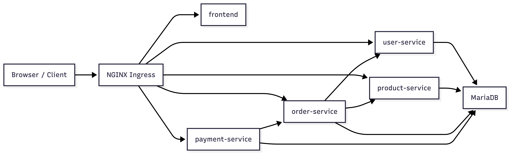
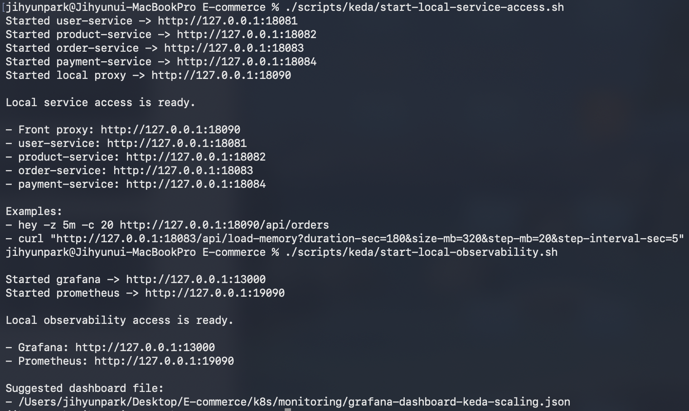

# 1. 아키텍처 설명

대상 시스템은 쇼핑몰 MSA이며 `user-service`, `product-service`, `order-service`, `payment-service`, `frontend`, `mariadb`로 구성했다. Kubernetes에서는 `ecommerce` 네임스페이스를 기준으로 서비스별 `Deployment`와 `Service`를 분리했고, 외부 요청은 `nginx` Ingress를 통해 `skala3-cloud1-team4.cloud.skala-ai.com` 호스트로 받도록 구성했다.



서비스 의존성은 다음과 같다. `user-service`와 `product-service`는 독립 서비스이고, `order-service`가 사용자/상품 정보를 조회하며, `payment-service`가 주문 정보를 참조한다. 데이터 저장소는 MariaDB 를 사용하지만 `user_service_db`, `product_service_db`, `order_service_db`, `payment_service_db`처럼 DB를 서비스별로 분리해 논리적 경계를 유지했다. 이 DB들은 `k8s/database/init-job.yaml`에서 초기 생성한다.

운영 관점에서는 다음 구성이 핵심이다.

- `k8s/configmap.yaml`: 호스트, 프로필, 서비스 간 base URL, DB 이름 주입
- `k8s/secret.yaml`: MariaDB 계정 정보 주입
- `k8s/database/statefulset.yaml`: MariaDB를 `StatefulSet`으로 운영
- `k8s/*/deployment.yaml`: 서비스별 probe, resource, Prometheus scrape annotation, `PriorityClass` 적용
- `k8s/ingress.yaml`: `/api/users`, `/api/products`, `/api/orders`, `/api/payments`와 Swagger/Actuator 경로 라우팅
- `k8s/*/scaledobject.yaml`: KEDA 기반 autoscaling 설정

# 2. 실행방법

실행 순서는 아래와 같다. 전제 조건은 클러스터에 `nginx ingress`, `KEDA`, `Prometheus`가 이미 설치되어 있고, 노드에서 `amdp-registry.skala-ai.com` 이미지에 접근 가능해야 한다는 점이다.

```bash
kubectl apply -f k8s/namespace.yaml
kubectl apply -f k8s/priorityclass.yaml
kubectl apply -f k8s/secret.yaml
kubectl apply -f k8s/configmap.yaml

kubectl apply -f k8s/database/service.yaml
kubectl apply -f k8s/database/statefulset.yaml
kubectl apply -f k8s/database/init-job.yaml

kubectl apply -f k8s/user
kubectl apply -f k8s/product
kubectl apply -f k8s/order
kubectl apply -f k8s/payment

kubectl apply -f k8s/ingress.yaml
```

배포 후 확인 명령은 아래 순서로 정리할 수 있다.

```bash
kubectl get pods -n ecommerce
kubectl get svc -n ecommerce
kubectl get ingress -n ecommerce
kubectl get scaledobject -n ecommerce
kubectl get hpa -n ecommerce
```

외부 검증은 `Ingress`로 노출된 사용자 API를 이용해 확인할 수 있다.

```bash
curl http://skala3-cloud1-team4.cloud.skala-ai.com/api/users
```

# 3. 부하테스트 계획 및 결과

## 3.1 부하테스트 방법

본 테스트는 Kubernetes 클러스터 내 이커머스 핵심 서비스(User, Product, Order, Payment)의 안정성을 확인하고, KEDA(Kubernetes Event-driven Autoscaling)를 통한 오토스케일링 동작을 검증하는 데 목적이 있다.

주요 관찰 포인트:
- KEDA/ScaledObject 연동: 외부 메트릭(Prometheus) 및 리소스 메트릭의 정상 수집 여부
- HPA Target 활성화: 커스텀 메트릭이 HPA Target 값에 정상 반영되는지 확인
- 복제본(Replica) 동적 제어: 부하 증가에 따른 실제 Pod 생성 시도 및 부하 종료 후 안정 상태 복귀(Scale-in)
- 장애 요인 파악: 확장 과정에서의 Pending, ImagePullBackOff, OOMKill 등 병목 현상 식별

관찰 대상은 아래와 같다.

- `ScaledObject`와 KEDA가 외부 메트릭을 정상 수집하는지
- HPA target 값이 정상적으로 보이는지
- replica 증가가 실제로 시도되는지
- scale-out 과정에서 `Pending`, `ImagePullBackOff`, `OOMKill`이 발생하는지
- 부하 종료 후 안정 상태로 복귀하는지

## 3.2 부하테스트 계획


| 항목 | 계획 내용 |
| --- | --- |
| 대상 서비스 | `product-service`, `order-service`, `payment-service` |
| 목적 | KEDA/HPA 연동 확인, scale-out 시도 확인, 운영 안정성 검증 |
| 부하 생성 방식 | 1. hey: HTTP 요청 급증을 통한 Prometheus 메트릭 트리거 <br> 2. curl (/api/load-memory): 메모리 점유를 통한 리소스 트리거 |
| 측정 지표 | external.metrics.k8s.io, HPA Target 수치, Replica 수, Pod Status |
| 기대 동작 | 기본 replica에서 추가 replica 생성 시도, 비정상 Pod는 probe로 트래픽 제외 |
| 성공 기준 | KEDA-Prometheus-HPA 체인 연결 확인, Scale-out 시도 확인, 핵심 서비스 접근 유지 |
| 위험 및 대응 | 로컬 클러스터 리소스(CPU/MEM) 부족 시 maxReplicaCount 하향 조정 및 파드 우선순위 검토 |


## 3.3 부하테스트 실행 및 결과
실행 스크립트: `./scripts/keda/start-local-service-access.sh`



### 3.3.1 오토스케일링 트리거 검증
---
테스트 결과, order-service를 대상으로 한 부하 주입 시 KEDA가 외부 메트릭을 성공적으로 전달함을 확인하였다.

Prometheus Metric (s1-prometheus): 타겟 수치인 600을 크게 상회하는 **12445m**이 관측됨.

HPA 상태 변화: 메트릭 급증에 따라 HPA가 즉각적으로 반응하여 REPLICAS를 최소 1개에서 최대 3개로 확장 시도함. (SuccessfulRescale 이벤트 발생 확인)

### 3.3.2 인프라 한계 및 장애 분석
---
단순 YAML 배포를 넘어 실제 Scale-out 경로를 검증하는 과정에서 다음과 같은 운영 환경의 한계가 식별되었다.

리소스 부족 (Insufficient CPU): payment-service 및 product-service 확장 시 일부 Pod가 Pending 상태에 머무름. kubectl describe 확인 결과 노드 내 가용 CPU 부족이 주원인으로 파악됨.

이미지 풀링 이슈 (ImagePullBackOff): 신규 Pod 생성 시 사설 레지스트리(Registry)와의 통신 문제로 EOF 오류 및 이미지 다운로드 실패 발생.

Rollout 지연: 리소스 부족과 이미지 이슈가 겹치며 신규 Revision이 Ready 상태가 되기까지의 시간이 길어져, 트래픽 폭증 시 즉각적인 대응에 한계가 있음이 드러남.

## 3.4 테스트를 통한 소결 및 시사점
본 테스트를 통해 KEDA 기반의 이벤트 기반 확장 메커니즘은 기술적으로 정상 작동함을 검증하였다. 다만, 로컬 환경의 물리적 리소스 제약으로 인해 무한한 확장은 불가능함을 확인하였으며, 향후 운영 환경에서는 다음과 같은 개선이 필요하다.

리소스 쿼터 최적화: 각 서비스별 requests/limits 재설정을 통한 자원 효율화.

레지스트리 안정화: 이미지 풀링 실패 방지를 위한 로컬 레지스트리 캐시 또는 네트워크 안정성 확보.

Warm-up 전략: Rollout 지연을 방지하기 위한 가벼운 이미지 구성 및 Readiness Probe 최적화.

# 4. 트러블 슈팅

## 4.1 CPU 부족으로 인한 Pending Pod

autoscaling 적용 후 `payment-service`, `product-service` 일부 Pod가 `Pending` 상태가 되었고, 원인은 `Insufficient cpu`였다. 해결 방향은 서비스별 `requests`와 `replica`, `maxReplicaCount`를 낮추는 것이었고, 최종적으로는 autoscaling pause를 적용해 안정 상태를 우선 확보했다.

## 4.2 KEDA external metrics 문제

실습 중 `external.metrics.k8s.io`가 `MissingEndpoints` 상태가 되었고, 이로 인해 HPA target이 `<unknown>`으로 보이는 문제가 있었다. 이를 해결하기 위해 KEDA와 Prometheus가 실제 `Running` 상태가 되도록 리소스를 다시 조정했고, 이후 external metrics 정상화를 확인했다.

## 4.3 사설 레지스트리 이미지 pull 실패

`payment-service`, `product-service` 신규 Pod가 `ImagePullBackOff`가 되었고, 레지스트리 요청 시 `EOF`가 발생했다. 이 문제는 애플리케이션 코드보다 이미지 레지스트리 접근 이슈로 판단했으며, 해결은 최신 revision 강행이 아니라 안정 버전 유지와 rollback 전략으로 접근했다.

## 4.4 rollout 장기화

신규 Pod가 정상 준비되지 못하면 `old replicas are pending termination` 상태가 길게 지속됐다. 이 경우 단순 재적용보다 `describe`를 통해 원인을 확인하고, image pull 문제와 연결해 rollback, recreate, pause 중 하나를 선택하는 것이 더 효과적이었다.

## 4.5 최종 안정화 전략

- `ScaledObject` 삭제보다 pause를 우선 사용
- replica는 1 기준의 안정 버전으로 유지
- 핵심 서비스 `Running` 상태 확보 후 다음 실습으로 진행
- 문제가 있는 새 ReplicaSet은 0으로 정리

# 5. HPA 설정 조정 값

현재 제출본에서 확인되는 autoscaling 관련 값은 아래와 같다.

| 서비스 | 기본 replica | 리소스 요청/제한 | 현재 스케일 범위 | 현재 트리거 값 | 조정 포인트 |
| --- | --- | --- | --- | --- | --- |
| `user-service` | 2 | `cpu 250m / mem 384Mi` 요청, `cpu 250m / mem 384Mi` 제한 | 고정 replica | HPA 미적용 | 사용자 API는 최종 제출본에서 2 replica 고정 운영 |
| `product-service` | 1 | `cpu 125m / mem 256Mi` 요청, `cpu 250m / mem 384Mi` 제한 | `min 1`, `max 3` | memory `307Mi`, Prometheus threshold `600`, polling `15s`, cooldown `60s` | scale-out은 허용하되 클러스터 압박을 줄이기 위해 상한을 3으로 제한 |
| `order-service` | 1 | `cpu 250m / mem 384Mi` 요청, `cpu 500m / mem 512Mi` 제한 | `min 1`, `max 3` | memory `409Mi`, Prometheus threshold `600`, polling `15s`, cooldown `60s` | 클러스터 리소스 압박을 고려하여 기존 상한값(5)을 3으로 하향 조정하였으며, 메모리 점유율 등 트리거 조건을 강화하여 보수적인 Scale-out 정책을 적용함 |
| `payment-service` | 1 | `cpu 150m / mem 256Mi` 요청, `cpu 350m / mem 512Mi` 제한 | `min 1`, `max 3` | memory `409Mi`, Prometheus threshold `600`, polling `15s`, cooldown `60s` | CPU 부족과 이미지 pull 이슈를 고려해 scale-out 상한을 보수적으로 유지 |
